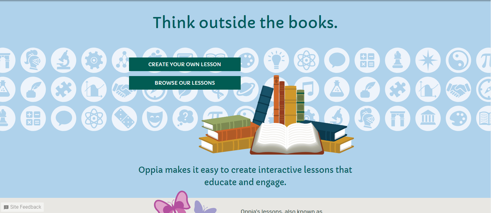
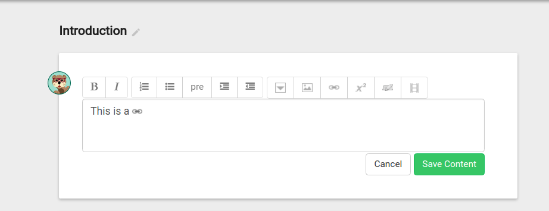
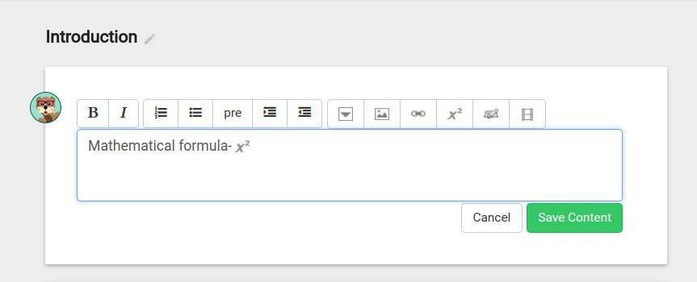
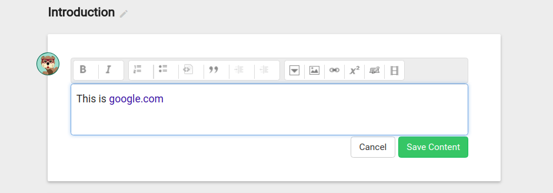
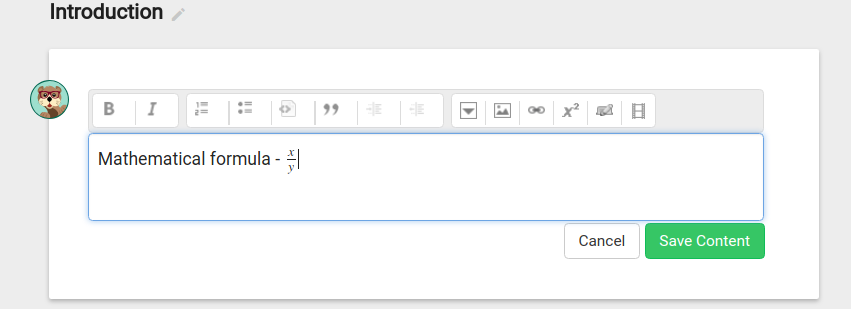

Every year, Google provides a platform to numerous open source organizations to be a part of there program [Google Summer of Code (GSoC)](https://summerofcode.withgoogle.com/). This program is indeed an integration of the best pool of mentors with amazing set of projects.Amidst a bunch of organisations,only a few have the fate to make it to the GSoC. The list of the chosen organizations is declared in February. It is this time when the students get into the groove and bring forth their best to enhance their contributions. Moreover, I have even come across individuals who initiate their contributions from the month of December in some of the accepted organizations, this certainly adds to their chance of selection. 

> As far as boosting the chances of selection is concerned,the top three things in the priority list should be:
- Improved quality of PR’s issued
- Involvement in more activities
- And finally,more the contributions, better the bonding with the community members and eventually better chances of crossing the mark!

Though an early start augments your chances but to begin right in February is all good. The thing which is crucial is to make the right choice, to have a thorough knowledge of every organisation's requisites and project list, moreover, an awareness of self strengths and weaknesses is significant.Your prowess should have some match with the organisation's required skill level for square pegs never fit in round holes.
This is when an early start helps, especially if you aren't an expert or say are well versed with only one among the three languages needed, you still could make it perfect! Amelioration of your aptitude is the key to be a pro in the open source society!

## My Road to Cracking GSoC

In my honest opinion, I never knew the exact working of git till December ’17. To grasp some basic informations regarding the git stuff,I began with a few basic tutorials. I started my contribution in the [p5.js](https://github.com/processing/p5.js) organization. The two main reasons behind this choice was that firstly, this org has made it to the GSoC back to back in the past couple of years. Moreover it required JavaScript, over which I possess a good fluency. I was able to merge 8-9 PR’s within a span of 10-12 days and this certainly compounded my confidence level. Later then, some difficult issues popped up and also I was curious to learn about some other organisations. So I chose [Mozilla Brackets](https://github.com/mozilla/brackets) organization. The thing with this org is that it has an upper hand amongst rest others and also has a great bunch of work going on. My initial endeavours confined to fixing good first bugs which was quite easy and was associated with simple html/css stuff. After these basic fixes, I added to my list the longest [PR](https://github.com/mozilla/brackets/pull/916) in this org,till date, it had about **1200** additions. The work in this PR was akin to some of those I did earlier and thus better understanding of the work webbed with an efficient implementation made this possible. I received comments like 

> Wow, this is fantastic! I'm blown away that you did it so quickly. @flukeout would love this. I'll review code soon  

These were truly a great source of invigoration and eventually I was able to merge some more relatable PR’s here.

Apart from contributions in the Mozilla Brackets, I also increased my horizon of organisations by keeping an eye on those organisations which have applied for GSoc and their prerequisites.
In this quest of mine, Oppia organisation interested me the most! The sole reason behind this inclination was the **noble cause** they work for: providing free education to each and everyone.They required command over python and AngularJS. As far as Python is concerned, I was never too bad at it, so that was perfectly fine but I hardly had a clue about Angular JS but I was good at JS. Here to my initial attempts began with fixing basic nits.

On the D-day in mid Feb, the organisation list was announced and Oppia, p5.js and Mozilla were selected. My desire pulled me to contributing to Oppia. However, I lost my key 5-6 days as I had to be up for my examinations. After I was done with the exams, I became quite active in my contributions and also had some meetings with the org admin. I took my time to wisely choose a project and finally took up **Rich Text Editor Upgrade**. To make proposals for the same was an elusive task as the accepted proposals for this org were brimming with details.

> If I choose to opine, a good proposal should have following characteristics:
 - Full of details regarding each component - How will you do, how much time will each component take etc.
- Code snippets - pseudo codes will work, these may not be (should not be :P ) exact
- Get a review - It’s good to get your proposal reviewed from your mentors before submission and work deeply into those suggestions.
- Don’t over say anything - Take enough time to implement each component. I bear testimony to certain things getting longer than expected. 

## About My Project

The aim of the project **Rich Text Editor Upgrade** was to find a replacement for the **TextAngular** (Rich Text Editor) used by Oppia in the form of  **CKEditor**. There were issues related with the preview mode in TextAngular like [issue#1](https://github.com/oppia/oppia/issues/3576), [issue#2](https://github.com/oppia/oppia/issues/3032), [issue#3](https://github.com/oppia/oppia/issues/2083) etc. There was an image inserted for any Mathematical formula that you add, for any link that you insert etc. To rise above all these issues,an upgradation to the CKEditor was incumbent.

 Fig 1. This figure shows that any link that you insert will be previewed as the image of the link symbol.

 Fig 2. This figure shows that for any mathematical stuff that we write an image of x^2 is seen. 

This project can be divided into three milestones:
1. Conversion of the html data to a format compatible with TextAngular
2. Integration of CKEditor
3. Conversion of content to a format compatible with CKEditor

Oppia had used quite a few editors till time so the html content (content written in the Editor) lacked a fixed format. My first task was to migrate this content into a form compatible with TextAngular. This was a clean up process so that while migrating this content to CKEditor format we are sure that our current content is in one particular format, this made migration a lot easier. 
To achieve this, I implemented a one-off job to validate the content in TextAngular format. I asked org admins to run this job on the test server and production server data and let me know the strings that fail this validation. There were lots of strings, I went over some of them manually (also had the information what parent-child relation are present in the data but not allowed in TextAngular) and checked the cases for which the validation fails. I wrote a migration one-off job to cover these cases and ran the validation job after the migration. The latter job still had some invalid strings though the number reduced significantly. I updated my migration job to cover all the cases and we were good to go.

The second job was to integrate the CKEditor. My mentor had a good lot of work regarding the  same and I used that set of well written documentations of the CKEditor as a reference and efficiently did the integration.

Finally, the last leg was to convert the content into CKEditor, which also followed on the similar lines as the first part except that in this case, I had an awareness about how the content apparently appears.

Fig 3. The link appears perfectly in the preview mode now.

Fig 4. The mathematical formula is displayed correctly now.

Till 10th of July, I accomplished these milestones and then my mentors assigned me the work of validating customization arguments in Rich Text components. In this part, I executed a one-off job to validate all the arguments that were present in components like inserting images, videos, tabs, collapsible blocks, links and mathematical formulae. I had to explore the arguments to be present essentially in each of these rich components and ensure that they are in the correct format. The running job delineates every component that proves to be different from the expected behaviour. 

### Weekly Progress logs

#### Week #1:
- Implemented a one-off job to validate TextAngular content
- Pull Request: [Link](https://github.com/oppia/oppia/pull/4947)

#### Week #2: 
- Received invalid test cases from the server data and implemented the function to perform migration to TextAngular format.
- Pull Request: [Link](https://github.com/oppia/oppia/pull/4985)

#### Week #3:
- Added invalid html strings in the output of the validation job
- Pull Request: [Link](https://github.com/oppia/oppia/pull/5020)
- Received a subset of invalid strings (strings not in TextAngular format) along with invalid parent-child relationship

#### Week #4:
- Wrote migration-validation job to migrate and then validate the strings on the basis of information obtained above.
- Again obtained the set of invalid strings after running this job.
- Finally again updated the migration-validation job to cover these above cases.
- Pull Requests: [PR1](https://github.com/oppia/oppia/pull/5050), [PR2](https://github.com/oppia/oppia/pull/5065)

#### Week #5:
- Went through the Allan’s (mentor) work of integrating CKEditor
- Tried testing and implementing the same
- Allan’s Work : [Link](https://github.com/oppia/oppia/compare/ckeditor) (**thank you a ton for this one**)

#### Week #6:
- Implemented integration of CKEditor
- Updated the code to resolve errors that came in way
- Pull Request: https://github.com/oppia/oppia/pull/5150

#### Week #7:
- Added one-off job to validate CKEditor content
- Added migration-validation job for CKEditor content
- Pull Request: https://github.com/oppia/oppia/pull/5161, https://github.com/oppia/oppia/pull/5169

#### Week #8:
- Helped an Oppia GSoCer - Aashish
- Received invalid cases from the server data and updated the migration to cover all the strings and migrate them into a form compatible with CKEditor
- Pull Request: [PR1](https://github.com/oppia/oppia/pull/5185), [PR2](https://github.com/oppia/oppia/pull/5192), [PR3](https://github.com/oppia/oppia/pull/5228) 

#### Week #9, #10:
- Testing of the CKEditor (was also involved in testing work of fellow GSoCers)
- Fixed issues that were related with CKEditor
- Pull Request: [PR1](https://github.com/oppia/oppia/pull/5255), [PR2](https://github.com/oppia/oppia/pull/5258), [PR3](https://github.com/oppia/oppia/pull/5318), [PR4](https://github.com/oppia/oppia/pull/5352)

#### Week #11:
- Added one-off to validate customization arguments of Rich Text Components
- Opened a issue (#5400) which states there are extra lines at end of the editor in user typed data
- Pull Request: [PR1](https://github.com/oppia/oppia/pull/5362), [PR2](https://github.com/oppia/oppia/pull/5401)

#### Week #12:
- Opened issue (#5423) which states the unnecessary part present in toolbar icons
- Fixed the same as well
- Helped Aashish, he was badly stuck at a point (import pillow thing)
- Pull Request: [PR1](https://github.com/oppia/oppia/pull/5424)

#### Week #13:
- Submitted whole work to the mentors
- Organized the release of the Oppia organization
- Tested code and behaviour of fellow gsocers

Useful Links

- All commits to Oppia - [Link](https://github.com/oppia/oppia/commits/develop?author=bansalnitish)
- GSoC Project - [Link](https://github.com/oppia/oppia/wiki/Google-Summer-of-Code-2018#rich-text-editor-upgrade)
- Accepted Proposal - [Link](https://github.com/oppia/oppia/wiki/pdfs/GSoC2018NitishBansal.pdf)
- Daily Devlog - [Link](https://docs.google.com/document/d/1U131ViOTjTs5Zd4crD2hlbuOTefPPM-e6FW4dWqNtZE/edit?usp=sharing)

## Conclusions

As I conclude, I would like to take this golden opportunity to express my gratitude towards Google for giving a chance to various students to be a part of the Open Source society through GSoC. It would be sheer waste if I don't thank the entire Oppia Community for acceptance of my proposal and for allowing me to embark on this amazing adventure. Most importantly, I would give a special thanks to my mentor - **Allan Zhou** and the org admin - **Sean Lip** (who was also deeply involved in the project) for always being a guide to all my tasks. It is all true if I delineate that my mentors were always quick in reviewing the PRs  and readily helped me out through every stuck situation. To be honest, they were outstanding and I owe them a lot!

Initially, it never crossed my mind that a period of three months could make me learn this great deal of things. Working on this bulk of data and simultaneously indulging in the migrations was fantastic though needed an audacious remark. The work experience I received was truly worth all the efforts and I can promise that my association with Oppia is not coming to an end anyway soon.
